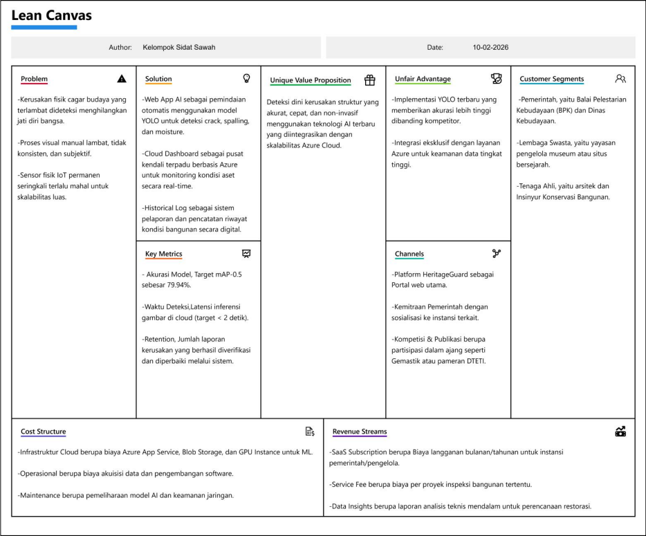

## Pembentukan Kelompok

| Nama | NIM | Peran |
| :--- | :--- | :--- |
| Muhammad Khaira Rahmadya Nauval | 23/521078/TK/57466 | Project Manager |
| Muhammad Hafidz Al Farisi | 23/519650/TK/57256 | Cloud Engineer |
| Muhammad Zufar Syaafi | 23/517479/TK/56923 | AI Engineer |

---

## Perumusan Permasalahan

**a. Nama Kelompok** Sidat Sawah

**b. Nama Produk** HeritageGuard

**c. Permasalahan yang Dipecahkan**

**Latar Belakang:** Sebuah bangunan merupakan infrastruktur krusial yang menunjang berbagai kegiatan manusia, namun seiring waktu akan mengalami kerusakan. Kerusakan ini dapat diklasifikasikan menjadi tiga tingkatan: ringan, sedang, dan berat. Kerusakan ringan terbatas pada komponen non-struktural, tingkat sedang mencakup kerusakan sebagian komponen non-struktural dan/atau struktural, sedangkan kerusakan berat meliputi sebagian besar komponen bangunan, baik struktural maupun non-struktural [1]. 

Kerentanan terhadap kerusakan juga berlaku pada bangunan cagar budaya, yang didefinisikan sebagai susunan binaan untuk memenuhi kebutuhan ruang [2]. Objek ini dapat mengalami deteriorasi, yaitu penurunan kualitas akibat faktor fisik, mekanis, kimiawi, hingga biologis [2]. Kerusakan pada cagar budaya dapat memicu degradasi kultural [3] dan menghentikan manfaatnya bagi kesejahteraan masyarakat, yang pada akhirnya dapat menghilangkan jati diri bangsa serta pendapatan masyarakat [2, 4]. 

Untuk mendeteksi kerusakan spesifik seperti retakan (*cracking*), pengelupasan (*spalling*), dan kelembapan (*moisture*), dapat digunakan teknologi pengolahan citra dengan model You Only Look Once (YOLO). YOLO bekerja dengan mendeteksi objek secara langsung menggunakan satu jaringan saraf tunggal [5]. Sebagai langkah preventif dan sistematis, diusulkan pengembangan platform HeritageGuard. Platform berbasis website ini mengintegrasikan model Artificial Intelligence YOLO untuk menyediakan sarana pemantauan otomasi dan pelaporan kerusakan cagar budaya yang cepat, akurat, dan terintegrasi.

**Rumusan Permasalahan:**
1. Bangunan cagar budaya terus mengalami deteriorasi akibat faktor fisik dan biologis yang jika dibiarkan akan menghilangkan jati diri bangsa serta manfaat ekonomi bagi masyarakat.
2. Proses inspeksi visual manual memberikan hasil kuantitatif yang tidak konsisten, sementara penggunaan alat sensor modern bersifat mahal dan kurang fleksibel untuk pemantauan rutin jangka panjang.
3. Masih sedikitnya sisem berbasis web yang mampu mengintegrasikan transmisi data citra melalui jaringan komputer dengan pemrosesan AI di infrastruktur cloud, sehingga proses pelaporan kerusakan menjadi tidak efisien dan sulit diakses secara real-time oleh para stakeholders.

**Daftar Pustaka:**
* [1] Indonesia, Peraturan Menteri Pekerjaan Umum No. 24/PRT/M/2008 tentang Pedoman Pemeliharaan dan Perawatan Bangunan Gedung, 2008.
* [2] Indonesia, Undang-Undang Republik Indonesia Nomor 11 Tahun 2010 tentang Cagar Budaya, 2010.
* [3] A. B. Wibowo, "Strategi Pelestarian Benda/Situs Cagar Budaya Berbasis Masyarakat," Jurnal Konservasi Cagar Budaya Borobudur, vol. 8, no. 1, pp. 58-71, 2014.
* [4] K. D. Rahmat, "Konsep Pariwisata Berkelanjutan dalam Pelestarian Cagar Budaya," Jurnal Pariwisata Terapan, vol. 5, no. 1, pp. 1-10, 2021, doi:https://doi.org/10.22146/jpt
* [5] J. Redmon, S. Divvala, R. Girshick, and A. Farhadi, "You Only Look Once: Unified, Real-Time Object Detection," in Proc. IEEE Conf. Comput. Vis. Pattern Recognit. (CVPR), 2016, pp. 779-788.

---

**d. Ide Solusi yang Diusulkan Beserta Rancangan Fitur**

**Solusi:** Platform HeritageGuard. Platform berbasis website ini mengintegrasikan model Artificial Intelligence YOLO untuk menyediakan sarana pemantauan otomasi dan pelaporan kerusakan cagar budaya yang cepat, akurat, dan terintegrasi.

**Rancangan Fitur Solusi:**

| Fitur | Keterangan |
| :--- | :--- |
| Upload dan Scan | Pengguna dapat mengunggah citra bangunan yang akan dirposes oleh model AI |
| Deteksi Otomatis | Sistem secara instan mengenali dan menandai tiga jenis kerusakan, yaitu crack, spalling, dan moisture dengan memberikan kotak penanda |
| Automated Report Generator | Mengonversi hasil deteksi menjadi laporan formal yang berisi detail teknis kerusakan untuk diberikan kepada pihak berwenang. |

---

**e. Analisis Kompetitor**

**Kompetitor 1: T2D2**

| Atribut | Keterangan |
| :--- | :--- |
| **Nama Kompetitor** | T2D2 |
| **Jenis Kompetitor** | Direct |
| **Jenis Produk** | Platform SaaS berbasis cloud dan Deep Learning untuk mendeteksi kerusakan pada fasad dan struktur bangunan dari gambar/video (kamera/drone) |
| **Target Customer** | Insinyur struktur, pemilik gedung, pengelola aset |
| **Kelebihan** | Akurasi tinggi, Efisiensi sumber daya, Menjamin keamanan petugas |
| **Kekurangan** | Ketergantungan kualitas citra, Hanya kerusakan visual |
| **Key Competitive Advantage & Unique Value** | Model AI mereka dilatih dan divalidasi langsung oleh insinyur sipil kelas dunia, sehingga klasifikasinya sangat akurat secara teknis. |

**Kompetitor 2: Resensys**

| Atribut | Keterangan |
| :--- | :--- |
| **Nama Kompetitor** | Resensys |
| **Jenis Kompetitor** | Indirect |
| **Jenis Produk** | Sistem Wireless Structural Health Monitoring (SHM) menggunakan sensor "SenSPot" untuk mengukur kemiringan, regangan, dan getaran. |
| **Target Customer** | Pengelola bangunan bersejarah dan infrastruktur kritis |
| **Kelebihan** | Daya tahan alat yang ekstrem, Data *real-time*, Instalasi mudah |
| **Kekurangan** | Biaya *hardware* yang tidak murah, Butuh keahlian khusus |
| **Key Competitive Advantage & Unique Value** | Teknologi hemat energi yang memungkinkan sensor dipasang sekali dan ditinggalkan selama satu dekade. Ini sangat cocok dengan cagar budaya yang sulit diakses untuk *maintenance* rutin. |

**Kompetitor 3: Move Solutions**

| Atribut | Keterangan |
| :--- | :--- |
| **Nama Kompetitor** | Move Solutions |
| **Jenis Kompetitor** | Indirect |
| **Jenis Produk** | Ekosistem sensor nirkabel yang terhubung ke platform cloud "MyMove" untuk analisis dinamis struktur |
| **Target Customer** | Perusahan konstruksi, pengelola warisan budaya, dan manajer infrastruktur kota |
| **Kelebihan** | Analisis yang Dinamis, Konektivitas yang stabil, *Event-based monitoring* |
| **Kekurangan** | Kompleksitas data yang dihasilkan, Tidak memberikan bukti visual |
| **Key Competitive Advantage & Unique Value** | Mereka menampilkan angka sensor sekaligus memiliki algoritma bawaan untuk memproses data getaran kompleks secara otomatis di *cloud* yang memberikan wawasan luas terkait perilaku dari sebuah struktur bangunan. |

---

## Lean Canvas

