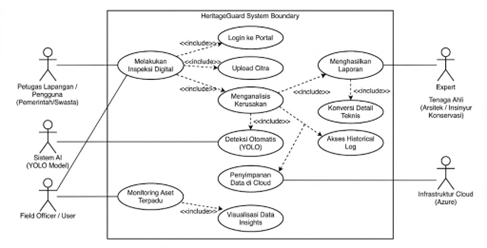
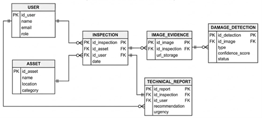

## Metodologi SDLC

**Metodologi yang digunakan:** Agile

**Alasan pemilihan metodologi:**

Metodologi Agile dipilih karena HeritageGuard menggunakan sistem berbasis AI yang memerlukan iterasi berkelanjutan untuk meningkatkan akurasi model dan membutuhkan validasi bertahap dari pengguna. Metodologi ini memungkinkan pengembangan inkremental dan continuous, serta pencegahan risiko lebih awal.

---

## Perancangan Tahap 1-3 SDLC

**a. Tujuan dari Produk**

Sistem ini dirancang untuk meningkatkan efisiensi proses inspeksi, mengurangi subjektivitas penilaian manual, serta menyediakan dokumentasi terstandarisasi mengenai kerusakan pada bangunan yang dapat diakses secara real-time oleh pemangku kepentingan. Selain itu, produk ini bertujuan mendukung pelestarian cagar budaya melalui pemantauan preventif berbasis data dan teknologi.

---

**b. Pengguna Potensial dari Produk dan Kebutuhan Para Pengguna Tersebut**

Pengguna potensial dari produk HeritageGuard meliputi instansi pemerintah seperti Dinas Kebudayaan dan Balai Pelestarian Cagar Budaya, pengelola museum atau situs bersejarah, konsultan teknik sipil dan konservasi bangunan, peneliti di bidang pelestarian struktur, manajer aset bangunan bersejarah, dll. Para pengguna ini memiliki kebutuhan berupa sistem yang mampu membantu proses inspeksi kerusakan bangunan secara lebih objektif, efisien, dan terdokumentasi dengan baik.

Dari sisi **kebutuhan fungsional**, pengguna memerlukan kemampuan untuk mengunggah citra bangunan dengan mudah melalui platform berbasis web, memperoleh hasil deteksi otomatis terhadap jenis kerusakan seperti crack, spalling, dan moisture, serta melihat visualisasi area kerusakan dalam bentuk bounding box pada gambar. Selain itu, sistem harus mampu mengonversi hasil deteksi menjadi laporan teknis formal yang dapat digunakan sebagai dokumen pendukung pengambilan keputusan. Fitur penyimpanan inspeksi juga dibutuhkan agar pengguna dapat membandingkan kondisi bangunan dari waktu ke waktu dan memantau tingkat deteriorasi secara berkelanjutan.

Di lain sisi, untuk **kebutuhan non-fungsional**, sistem diharapkan memiliki tingkat akurasi deteksi yang tinggi, waktu respons yang cepat dalam memproses citra, serta keamanan data yang memadai melalui mekanisme autentikasi dan perlindungan akses. Karena sistem berjalan di atas infrastruktur cloud, skalabilitas dan ketersediaan layanan juga menjadi aspek penting agar platform tetap stabil saat diakses oleh banyak pengguna secara bersamaan. Selain itu, antarmuka pengguna harus dirancang supaya intuitif dan mudah digunakan oleh petugas lapangan, tenaga ahli, dan user.

---

**c. Use Case Diagram**

---

**d. Functional Requirements untuk Use Case yang Telah Dirancang**

| FR | Deskripsi |
| :--- | :--- |
| **FR 1 – Autentikasi Pengguna** | Sistem harus memverifikasi kredensial (username/password) Petugas Lapangan atau Tenaga Ahli sebelum memberikan akses ke portal. |
| **FR 2 – Unggah Citra/Foto** | Sistem harus memungkinkan Petugas Lapangan mengunggah foto bangunan cagar budaya dalam format yang ditentukan (misal: JPG, PNG) melalui antarmuka inspeksi. |
| **FR 3 – Inisiasi Analisis AI** | Sistem harus secara otomatis memicu proses analisis segera setelah citra berhasil diunggah. |
| **FR 4 – Deteksi Kerusakan Otomatis (YOLO)** | Sistem AI (menggunakan model YOLO) harus mampu mengidentifikasi dan melokalisasi jenis kerusakan tertentu (crack, spalling, moisture) pada citra yang diunggah. |
| **FR 5 – Penyimpanan Data ke Cloud** | Sistem harus menyimpan citra asli, citra hasil anotasi, dan metadata hasil deteksi secara aman ke Infrastruktur Cloud (Azure Blob Storage). |
| **FR 6 – Konversi Detail Teknis** | Sistem harus memformat data mentah hasil deteksi AI (koordinat, tingkat kepercayaan, jenis kerusakan) menjadi metrik teknis yang dapat dipahami oleh Tenaga Ahli. |
| **FR 7 – Pengambilan Data Historis** | Sistem harus mampu mengambil data inspeksi terdahulu berdasarkan ID aset untuk menyusun riwayat kerusakan kronologis. |
| **FR 8 – Generasi Laporan (Unduh PDF/Doc)** | Sistem harus memungkinkan Tenaga Ahli mengunduh laporan formal yang menggabungkan detail teknis terbaru dan data historis. |
| **FR 9 – Dashboard Monitoring Aset** | Sistem harus menyediakan antarmuka dashboard untuk melihat status kondisi seluruh aset yang terdaftar. |
| **FR 10 – Visualisasi Data Insights** | Sistem harus menampilkan visualisasi (grafik, peta panas kerusakan, tren) berdasarkan agregasi data hasil inspeksi pada dashboard. |

---

**e. Entity Relationship Diagram**

---

**f. Low-fidelity Wireframe**

---

**g. Gantt-Chart Pengerjaan Proyek dalam Kurun Waktu 1 Semester**

| Kegiatan | 1 | 2 | 3 | 4 | 5 | 6 | 7 | 8 | 9 | 10 | 11 | 12 |
| :--- | :---: | :---: | :---: | :---: | :---: | :---: | :---: | :---: | :---: | :---: | :---: | :---: |
| Brainstorming & Finalisasi Ide | ✓ | | | | | | | | | | | |
| Studi Literatur | ✓ | ✓ | | | | | | | | | | |
| Perancangan Sistem & Arsitektur Cloud | | ✓ | ✓ | | | | | | | | | |
| Perancangan UI/UX | | | ✓ | ✓ | | | | | | | | |
| Persiapan Dataset | | ✓ | ✓ | ✓ | | | | | | | | |
| Training & Finetuning Model YOLO | | | | ✓ | ✓ | ✓ | | | | | | |
| Pengembangan Back End (API dan integrasi AI) | | | | | ✓ | ✓ | ✓ | | | | | |
| Pengembangan Front End | | | | | | ✓ | ✓ | ✓ | | | | |
| Integrasi Cloud Deployment | | | | | | | ✓ | ✓ | ✓ | | | |
| Testing & Evaluasi Sistem | | | | | | | | | ✓ | ✓ | | |
| Penyempurnaan & Dokumentasi | | | | | | | | | | ✓ | ✓ | |
| Finalisasi | | | | | | | | | | | ✓ | ✓ |
